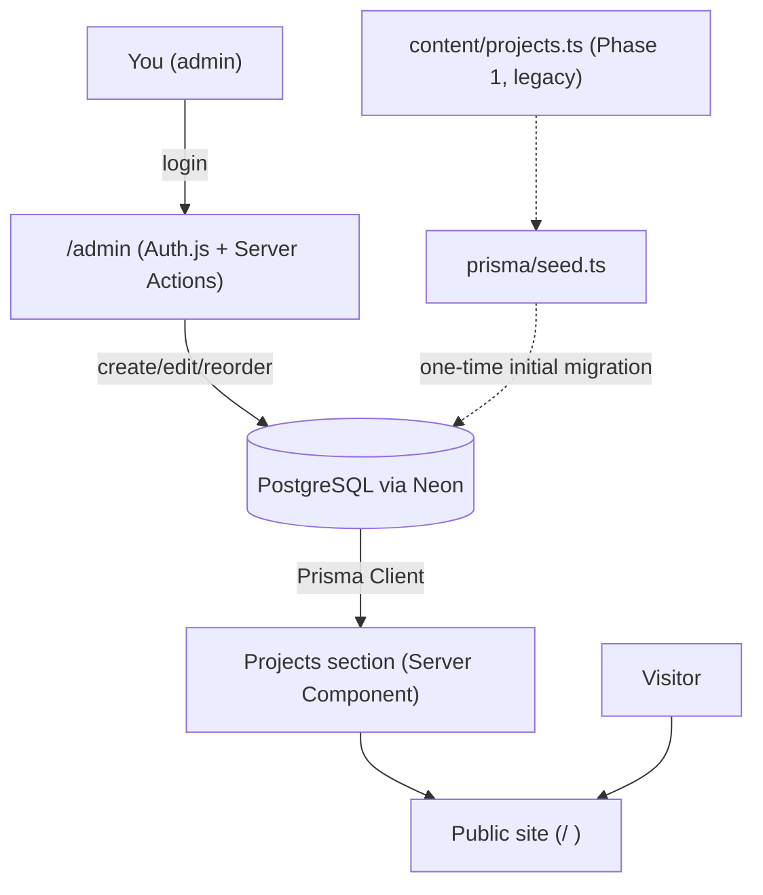

# gabrielamorim.dev

My personal portfolio. Unlike my other projects, this one doesn't solve a business
problem — it exists to tell you who I am, technically and personally, in a place I fully
control.

> Versão em português: [README.md](./README.md)

## Why this project exists

Most dev portfolios look the same: generic dark background, purple/blue gradient, "about
me" cards that read like LinkedIn bullet points. I wanted the opposite. A place with the
cadence of someone who spends time in silence, that breathes slowly, and still shows —
without decoration — the real technical work I sustain every day: leading a team,
keeping critical payment/logistics integrations alive, optimizing a database under
production pressure.

## Features

- **Public site** — hero with a 3D particle field, scroll storytelling, About, Experience,
  Projects, Skills and Contact sections.
- **Admin panel (`/admin`)** — login-protected, lets me create, edit, reorder,
  publish/draft and delete the projects shown on the site, without touching code or
  redeploying. Includes a live preview of the card before saving.

## Design direction — "nocturnal editorial garden"

The name I gave this aesthetic internally sums up the intent: a garden (organic, alive,
with its own pace) seen at night (contemplative, unhurried), with the typographic rigor of
an editorial magazine (authorial, not a template).

That translates into concrete decisions:

- **Earthy palette, not SaaS.** Near-black background with a green undertone
  (`soil-900`/`soil-950`), amber (`amber-400`) and moss-green (`moss-600`) accents, warm
  off-white text (`linen-200`). No generic product purple/blue.
- **Typography with personality.**
  [Fraunces](https://fonts.google.com/specimen/Fraunces) (serif, variable, with optical
  axes that give it an almost "breathing" feel) for headings,
  [Inter](https://fonts.google.com/specimen/Inter) for body copy — legible, clean, doesn't
  compete with the heading.
- **Texture, not shine.** A subtle grain overlay (CSS-generated SVG `feTurbulence`, no
  image asset loaded) gives a paper/film feel instead of standard digital "polish".
- **Spirituality without clip art.** No crystal, tarot or moon icons. The contemplative
  side of my life shows up in the scroll rhythm, the generous spacing between sections, and
  how the "About" copy is written — not in literal iconography.
- **Motion with purpose.** Smooth scroll (Lenis) + progressive reveals (GSAP ScrollTrigger
  + Framer Motion) make content appear at reading pace, not all at once. No decorative
  animation that doesn't carry meaning.
- **The `/admin` panel is deliberately different.** No grain, no smooth scroll, no
  particles — it's a work tool, not an editorial piece. Clarity wins over atmosphere there.

## Architecture



- The **public site** (`app/(site)`) stays fully static in content/experience (Hero, About,
  Experience, Skills, Contact) and only fetches **published projects** straight from the
  database on every request (`export const dynamic = "force-dynamic"` on the page) — an
  edit made in the panel shows up live, with no rebuild.
- The **panel** (`app/admin`) sits behind `middleware.ts`, which uses Auth.js to redirect
  any unauthenticated access to `/admin/login`.
- **Mutations** (create/edit/delete/reorder a project) are Server Actions in
  `app/admin/projects/actions.ts` — no separate REST API layer.

## Stack

| Layer | Choice | Why |
| --- | --- | --- |
| Framework | Next.js 14 (App Router) + TypeScript | Performance, SSR/SSG, DX |
| Styling | Tailwind CSS 3 | Design tokens centralized in `tailwind.config.ts` |
| Micro-interaction | Framer Motion | Hover states, component reveals, declarative transitions |
| Scroll storytelling | GSAP + ScrollTrigger | Hero parallax, experience timeline line |
| Smooth scroll | Lenis | Synced to GSAP's ticker to avoid conflicts |
| 3D / immersive | React Three Fiber + drei (on top of Three.js) | Organic particle field in the hero |
| Fonts | `next/font/google` (Fraunces + Inter) | Self-hosted, no layout shift |
| Database | PostgreSQL via [Neon](https://neon.tech) | Serverless-friendly, pairs well with Vercel functions |
| ORM | Prisma 6 (`prisma-client-js`) | Versioned migrations, same tool as DevLevel |
| Auth | Auth.js v5 (Credentials Provider) | Single admin login, no public sign-up — same stack as DevLevel |
| Password hashing | bcryptjs | Equivalent to DevLevel's `bcrypt`, but no native binary (simpler on Windows/Vercel) |
| Validation | Zod | Schemas shared between the form and the Server Action |
| Deploy | Vercel | Zero-config for Next.js |

> **Why Prisma/Auth.js/Postgres specifically?** Consistency with DevLevel. I already know
> this combination's pitfalls (the middleware's Edge runtime can't import the Prisma
> Client directly — see `auth.config.ts` vs `auth.ts` — and Credentials providers require
> JWT sessions). Reusing the same stack across personal projects means less new context
> every time I come back to one of them.

> Version note: `@react-three/fiber`/`@react-three/drei` are pinned to major 8/9 because
> major 9 requires React 19 as a peer — this project runs on React 18 (Next 14's stable
> default). Prisma is pinned to major 6 (not 7) because v7 made a driver adapter and a
> separate `prisma.config.ts` file mandatory for the database URL — more new surface area
> than this project needs right now.

## Content architecture

```
types/content.ts       → public shape (Project, ExperienceEntry, SkillGroup...)
content/site.ts          → name, role, tagline, contact links
content/experience.ts     → professional history
content/education.ts      → academic background
content/projects.ts        → original Phase 1 snapshot — now used only as the seed source
content/skills.ts          → skills by category + languages

prisma/schema.prisma      → Project, AdminUser, LoginAttempt models
prisma/seed.ts             → migrates content/projects.ts into the database + creates the admin
lib/projects.ts            → getPublishedProjects() used by the public section
lib/db.ts                  → Prisma Client singleton
auth.ts / auth.config.ts   → Auth.js configuration (see the Edge runtime note below)
middleware.ts               → protects /admin/*
app/admin/**                 → login, listing, create/edit (with preview), Server Actions
```

Experience, Skills and site data (`content/experience.ts`, `content/skills.ts`,
`content/site.ts`) remain static files by choice — only the Projects section needs frequent,
deploy-free edits. If that changes, the same pattern (`lib/*.ts` reading from Prisma)
replicates easily.

## Running locally

Prerequisites: Node 18.18+, [pnpm](https://pnpm.io) and a Postgres database (local or Neon).

```bash
pnpm install
cp .env.example .env
# fill in DATABASE_URL, AUTH_SECRET, ADMIN_EMAIL, ADMIN_PASSWORD in .env
pnpm db:migrate:dev   # applies migrations to the database pointed at by DATABASE_URL
pnpm db:seed          # migrates content/projects.ts + creates the admin user
pnpm dev
```

Open [http://localhost:3000](http://localhost:3000) for the site and
[http://localhost:3000/admin/login](http://localhost:3000/admin/login) for the panel.

### Generating environment variables

- **`DATABASE_URL`** — create a free project at
  [console.neon.tech](https://console.neon.tech), copy the connection string ("Pooled
  connection" works well with Vercel).
- **`AUTH_SECRET`** — generate a random value:
  ```bash
  node -e "console.log(require('crypto').randomBytes(32).toString('base64'))"
  ```
- **`ADMIN_EMAIL` / `ADMIN_PASSWORD`** — your `/admin` login credentials. Only read by
  `prisma/seed.ts` at seed time; after that, what matters is the hash already stored in the
  database. There's intentionally no public sign-up flow for new admins.

### Useful scripts

```bash
pnpm db:migrate        # applies pending migrations (production — prisma migrate deploy)
pnpm db:migrate:dev     # creates/applies migrations in development
pnpm db:seed            # runs prisma/seed.ts
pnpm db:studio          # opens Prisma Studio to inspect the database
```

To generate the production build (what Vercel runs on deploy):

```bash
pnpm build
pnpm start
```

## Deploy

Ready for Vercel: connect the repository, the framework is auto-detected as Next.js, and
the build runs `pnpm build` (which already runs `prisma generate` via `postinstall`).
Configure the same variables from `.env.example` on Vercel (`DATABASE_URL`, `AUTH_SECRET`) —
`ADMIN_EMAIL`/`ADMIN_PASSWORD` don't need to exist in production, since the seed is run
once, locally, pointed at the production database.

## Accessibility and performance

- `prefers-reduced-motion` is respected on two layers: a hook
  (`lib/useReducedMotionPref`) turns off the 3D canvas and reduces the amplitude of
  GSAP/Framer Motion animations; a global CSS rule (`app/globals.css`) zeroes out any
  residual animation/transition as a safety net.
- No intro screen blocks the content — the hero text loads immediately and the 3D canvas
  fades in progressively, with no "skip intro" gate needed.
- Sections below the first viewport (About, Experience, Projects, Skills, Contact) are
  code-split via `next/dynamic` in `app/(site)/page.tsx`.
- The hero's particle field reduces point count on screens narrower than 768px.
- Fonts loaded via `next/font/google` (self-hosted, `display: swap`, no FOUC).

## Panel security

- `httpOnly` session cookie, `Secure` in production (Auth.js default when the URL is
  HTTPS).
- Basic login rate limiting: 5 failed attempts per identifier (IP) in 15 minutes, counted
  directly in Postgres's own `LoginAttempt` table — I chose not to depend on an external
  service (Upstash) just for this; it's an easy reassessment if the panel's traffic ever
  justifies a more sophisticated limiter.
- `authorize()` never returns the password hash to Auth.js — only `id` and `email`.
- There's no public admin sign-up form. The single user is created via
  `prisma/seed.ts`, from environment variables.
- `middleware.ts` protects every `/admin/*` route; each Server Action in
  `app/admin/projects/actions.ts` also independently re-validates the session
  (defense in depth, in case the action is ever called outside the normal flow).

## Assets I still need to provide

- **Favicon**: provisional SVG at `app/icon.svg`, with the same particle motif as the hero.
- **Personal photo**: none in the hero/about section today.
- **Project screenshots**: the `coverImage` field already exists in the schema; once I have
  real screenshots, I can fill it in straight from `/admin` — no more code edits needed.

## Roadmap

Phase 2 (this admin panel) is now implemented. Possible next steps, none of them blocking
what's already live:

1. **Real image upload** — today `coverImage` is a manual URL; swap for direct upload
   (Vercel Blob or Cloudinary) once that's worth the effort.
2. **Per-project detail page** — the `longDescription` field already exists in the schema
   and the form, but there's no `/projects/[slug]` route displaying it yet.
3. **Edit Experience/Skills from the panel** — today only Projects are editable via
   `/admin`; if my professional experience starts changing often, the same pattern
   (Prisma + Server Actions) extends there too.
4. **More robust rate limiting** — move from a Postgres table to Upstash/Redis if the
   panel ever sees meaningful suspicious traffic.
