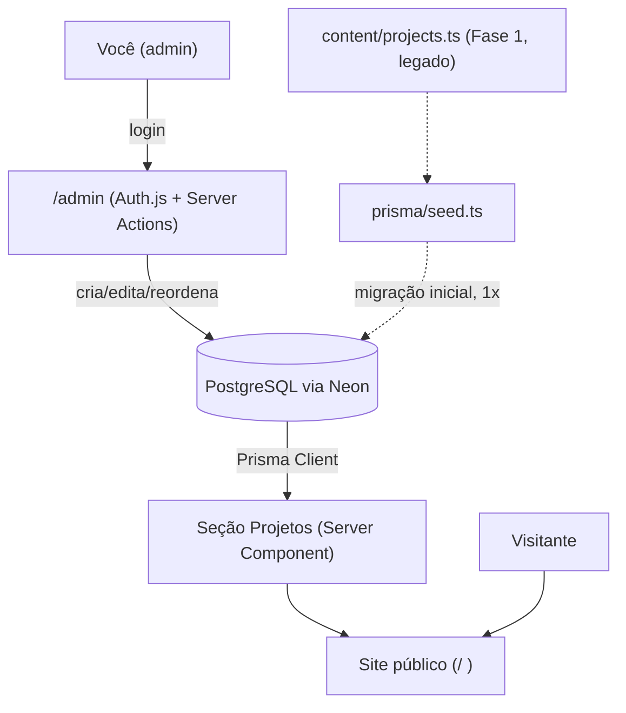

# gabrielamorim.dev

Meu portfólio pessoal. Diferente dos meus outros projetos, esse aqui não resolve um
problema de negócio — ele existe para contar quem eu sou, técnica e pessoalmente, num
lugar que eu controlo por completo.

## Por que esse projeto existe

A maior parte dos portfólios de dev parece a mesma coisa: fundo escuro genérico, gradiente
roxo/azul, cards de "sobre mim" com bullet points de LinkedIn. Eu queria o oposto disso.
Queria um lugar que tivesse a cadência de quem passa tempo em silêncio, que respirasse
devagar, e que ainda assim mostrasse — sem enfeite — o trabalho técnico real que sustento
todos os dias: liderar um time, manter integrações críticas de pagamento e logística no ar,
e otimizar banco de dados sob pressão de produção.

## Funcionalidades

- **Site público** — hero com campo de partículas em 3D, storytelling de scroll, seções de
  Sobre, Experiência, Projetos, Habilidades e Contato.
- **Painel administrativo (`/admin`)** — protegido por login, permite criar, editar,
  reordenar, publicar/rascunhar e excluir projetos exibidos no site, sem precisar editar
  código ou fazer novo deploy. Inclui preview em tempo real do card antes de salvar.

## Direção de design — "jardim editorial noturno"

O nome que dei internamente pra essa estética resume a intenção: um jardim (orgânico, vivo,
com seu próprio tempo) visto à noite (contemplativo, sem pressa), com o rigor tipográfico de
uma revista editorial (autoral, não-template).

Isso se traduz em decisões concretas:

- **Paleta terrosa, não SaaS.** Fundo quase preto com sub-tom verde (`soil-900`/`soil-950`),
  acentos em âmbar (`amber-400`) e verde-musgo (`moss-600`), texto em off-white quente
  (`linen-200`). Nada de roxo/azul genérico de produto.
- **Tipografia com personalidade.** [Fraunces](https://fonts.google.com/specimen/Fraunces)
  (serifada, variável, com eixos ópticos que dão uma sensação quase "respirando") para
  títulos, [Inter](https://fonts.google.com/specimen/Inter) para o corpo — legível, limpa,
  sem competir com o título.
- **Textura, não brilho.** Um overlay de grain sutil (SVG `feTurbulence` gerado em CSS, sem
  nenhuma imagem carregada) dá uma sensação de papel/filme em vez do "polimento" digital
  padrão.
- **Espiritualidade sem clipart.** Nenhum ícone de cristal, tarot ou lua. A parte
  contemplativa da minha vida aparece no ritmo do scroll, no espaço generoso entre seções, e
  na forma como o texto da seção "Sobre" é escrito — não em iconografia literal.
- **Movimento com propósito.** Scroll suave (Lenis) + revelações progressivas (GSAP
  ScrollTrigger + Framer Motion) fazem o conteúdo aparecer no ritmo da leitura, não tudo de
  uma vez. Nada de animação decorativa que não carregue significado.
- **O painel `/admin` é deliberadamente diferente.** Sem grain, sem scroll suave, sem
  partículas — é uma ferramenta de trabalho, não uma peça editorial. Clareza vence atmosfera
  ali.

## Arquitetura



- **Site público** (`app/(site)`) segue 100% estático em conteúdo/experiência (Hero, Sobre,
  Experiência, Habilidades, Contato) e busca só os **projetos publicados** direto do banco a
  cada request (`export const dynamic = "force-dynamic"` na página) — uma edição no painel
  aparece no ar imediatamente, sem rebuild.
- **Painel** (`app/admin`) fica atrás do `middleware.ts`, que usa Auth.js para redirecionar
  qualquer acesso não autenticado para `/admin/login`.
- **Mutações** (criar/editar/excluir/reordenar projeto) são Server Actions em
  `app/admin/projects/actions.ts` — sem uma camada de API REST separada.

## Stack

| Camada | Escolha | Por quê |
| --- | --- | --- |
| Framework | Next.js 14 (App Router) + TypeScript | Performance, SSR/SSG, DX |
| Estilo | Tailwind CSS 3 | Tokens de design centralizados em `tailwind.config.ts` |
| Micro-interação | Framer Motion | Hover, reveals de componente, transições declarativas |
| Storytelling de scroll | GSAP + ScrollTrigger | Parallax do hero, linha da timeline de experiência |
| Smooth scroll | Lenis | Sincronizado ao ticker do GSAP para não conflitar |
| 3D / imersivo | React Three Fiber + drei (sobre Three.js) | Campo de partículas orgânico no hero |
| Fontes | `next/font/google` (Fraunces + Inter) | Self-hosted, sem layout shift |
| Banco de dados | PostgreSQL via [Neon](https://neon.tech) | Serverless-friendly, combina bem com funções da Vercel |
| ORM | Prisma 6 (`prisma-client-js`) | Migrations versionadas, mesma ferramenta do DevLevel |
| Autenticação | Auth.js v5 (Credentials Provider) | Login único de admin, sem cadastro público — mesma stack do DevLevel |
| Hash de senha | bcryptjs | Equivalente ao `bcrypt` do DevLevel, mas sem binário nativo (mais simples no Windows/Vercel) |
| Validação | Zod | Schemas compartilhados entre formulário e Server Action |
| Deploy | Vercel | Zero-config para Next.js |

> **Por que Prisma/Auth.js/Postgres especificamente?** Consistência com o DevLevel. Já
> conheço as armadilhas dessa combinação (runtime Edge do middleware não pode importar o
> Prisma Client diretamente — ver `auth.config.ts` vs `auth.ts` — e providers de Credentials
> exigem sessão em JWT). Repetir a stack entre projetos pessoais significa menos contexto
> novo a cada vez que eu volto a um deles.

> Nota de versões: `@react-three/fiber`/`@react-three/drei` estão pinados na major 8/9
> porque a major 9 exige React 19 como peer — este projeto roda em React 18 (padrão estável
> do Next 14). Prisma está pinado na major 6 (não na 7) porque a v7 tornou obrigatório um
> driver adapter e um arquivo `prisma.config.ts` separado para a URL do banco — mais
> superfície nova do que o projeto precisa agora.

## Estrutura de conteúdo

```
types/content.ts       → shape público (Project, ExperienceEntry, SkillGroup...)
content/site.ts         → nome, cargo, tagline, contatos
content/experience.ts    → histórico profissional
content/education.ts     → formação acadêmica
content/projects.ts      → snapshot original da Fase 1 — hoje usado só como fonte do seed
content/skills.ts        → habilidades por categoria + idiomas

prisma/schema.prisma     → modelos Project, AdminUser, LoginAttempt
prisma/seed.ts           → migra content/projects.ts para o banco + cria o admin
lib/projects.ts          → getPublishedProjects() usado pela seção pública
lib/db.ts                → singleton do Prisma Client
auth.ts / auth.config.ts → configuração do Auth.js (ver nota de Edge runtime abaixo)
middleware.ts             → protege /admin/*
app/admin/**              → login, listagem, criar/editar (com preview), Server Actions
```

Experiência, Habilidades e dados do site (`content/experience.ts`, `content/skills.ts`,
`content/site.ts`) continuam sendo arquivos estáticos por decisão — só a seção de Projetos
precisa de edição frequente sem deploy. Se isso mudar, o mesmo padrão (`lib/*.ts` lendo do
Prisma) se replica facilmente.

## Rodando localmente

Pré-requisitos: Node 18.18+, [pnpm](https://pnpm.io) e um banco Postgres (local ou Neon).

```bash
pnpm install
cp .env.example .env
# preencha DATABASE_URL, AUTH_SECRET, ADMIN_EMAIL, ADMIN_PASSWORD no .env
pnpm db:migrate:dev   # aplica as migrations no banco apontado por DATABASE_URL
pnpm db:seed          # migra content/projects.ts + cria o usuário admin
pnpm dev
```

Abra [http://localhost:3000](http://localhost:3000) para o site e
[http://localhost:3000/admin/login](http://localhost:3000/admin/login) para o painel.

### Gerando as variáveis de ambiente

- **`DATABASE_URL`** — crie um projeto gratuito em
  [console.neon.tech](https://console.neon.tech), copie a connection string ("Pooled
  connection" funciona bem com a Vercel).
- **`AUTH_SECRET`** — gere um valor aleatório:
  ```bash
  node -e "console.log(require('crypto').randomBytes(32).toString('base64'))"
  ```
- **`ADMIN_EMAIL` / `ADMIN_PASSWORD`** — as credenciais do seu login em `/admin`. São lidas
  apenas por `prisma/seed.ts` no momento do seed; depois disso, o que importa é o hash já
  salvo no banco. Não existe cadastro público de novos admins de propósito.

### Scripts úteis

```bash
pnpm db:migrate        # aplica migrations pendentes (produção — prisma migrate deploy)
pnpm db:migrate:dev     # cria/aplica migrations em desenvolvimento
pnpm db:seed            # roda prisma/seed.ts
pnpm db:studio          # abre o Prisma Studio para inspecionar o banco
```

Para gerar o build de produção (o que a Vercel roda no deploy):

```bash
pnpm build
pnpm start
```

## Deploy

Projeto pronto para a Vercel: conecte o repositório, o framework é detectado
automaticamente como Next.js, e o build usa `pnpm build` (que já executa `prisma generate`
via `postinstall`). Configure na Vercel as mesmas variáveis do `.env.example`
(`DATABASE_URL`, `AUTH_SECRET`) — `ADMIN_EMAIL`/`ADMIN_PASSWORD` não precisam existir em
produção, já que o seed é rodado uma vez, localmente, apontando para o banco de produção.

## Acessibilidade e performance

- `prefers-reduced-motion` é respeitado em duas camadas: um hook (`lib/useReducedMotionPref`)
  desliga o Canvas 3D e reduz amplitude das animações de GSAP/Framer Motion; uma regra CSS
  global (`app/globals.css`) zera qualquer animação/transição residual como rede de
  segurança.
- Nenhuma tela de intro bloqueia o conteúdo — o hero carrega o texto imediatamente e o
  Canvas 3D entra com fade progressivo, sem gate de "pular introdução".
- Seções abaixo da primeira viewport (Sobre, Experiência, Projetos, Habilidades, Contato)
  são code-split via `next/dynamic` em `app/(site)/page.tsx`.
- O campo de partículas do hero reduz a contagem de pontos em telas menores que 768px.
- Fontes carregadas via `next/font/google` (self-hosted, `display: swap`, sem FOUC).

## Segurança do painel

- Sessão em cookie `httpOnly`, `Secure` em produção (padrão do Auth.js quando a URL é HTTPS).
- Rate limiting básico de login: 5 tentativas falhas por identificador (IP) em 15 minutos,
  contado direto na tabela `LoginAttempt` do próprio Postgres — decidi não depender de um
  serviço externo (Upstash) só para isso; é uma reavaliação simples se o tráfego do painel
  algum dia justificar um limitador mais sofisticado.
- `authorize()` nunca retorna o hash da senha para o Auth.js — só `id` e `email`.
- Não existe formulário público de cadastro de admin. O único usuário é criado via
  `prisma/seed.ts`, a partir de variáveis de ambiente.
- `middleware.ts` protege todas as rotas `/admin/*`; cada Server Action em
  `app/admin/projects/actions.ts` também revalida a sessão de forma independente
  (defesa em profundidade, caso a action seja chamada fora do fluxo normal).

## Assets que ainda preciso fornecer

- **Favicon**: SVG provisório em `app/icon.svg`, com o mesmo motivo de partículas do hero.
- **Foto pessoal**: não há foto no hero/sobre hoje.
- **Screenshots dos projetos**: o campo `coverImage` já existe no schema; ao ter capturas de
  tela reais, basta preencher pelo próprio `/admin` — não precisa mais editar código.

## Roadmap

A Fase 2 (este painel administrativo) já está implementada. Próximos passos possíveis,
nenhum deles bloqueando o que já está no ar:

1. **Upload de imagem real** — hoje `coverImage` é uma URL manual; trocar por upload direto
   (Vercel Blob ou Cloudinary) quando isso valer o esforço.
2. **Página de detalhe por projeto** — o campo `longDescription` já existe no schema e no
   formulário, mas ainda não tem uma rota `/projetos/[slug]` para exibi-lo.
3. **Editar Experiência/Habilidades pelo painel** — hoje só Projetos são editáveis via
   `/admin`; se a experiência profissional mudar com frequência, o mesmo padrão
   (Prisma + Server Actions) se estende para lá.
4. **Rate limiting mais robusto** — migrar de tabela Postgres para Upstash/Redis se o
   painel algum dia receber tráfego suspeito relevante.
